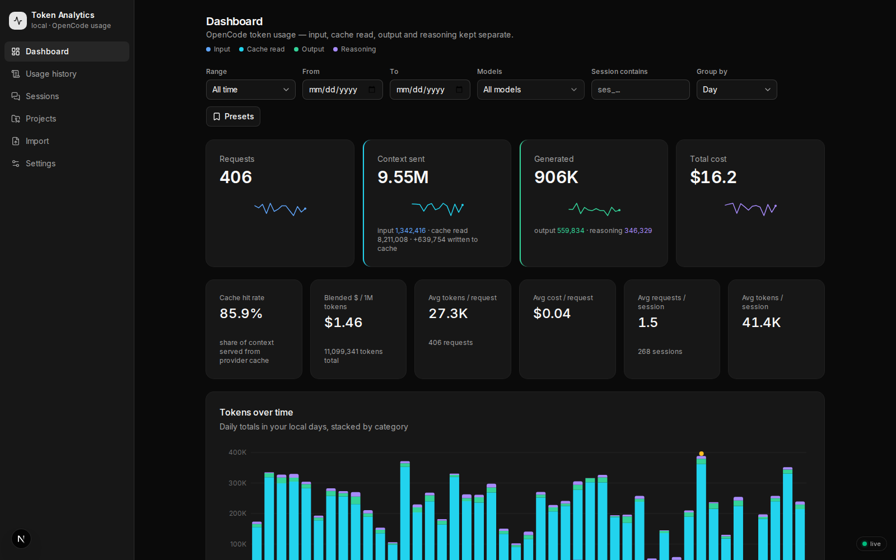
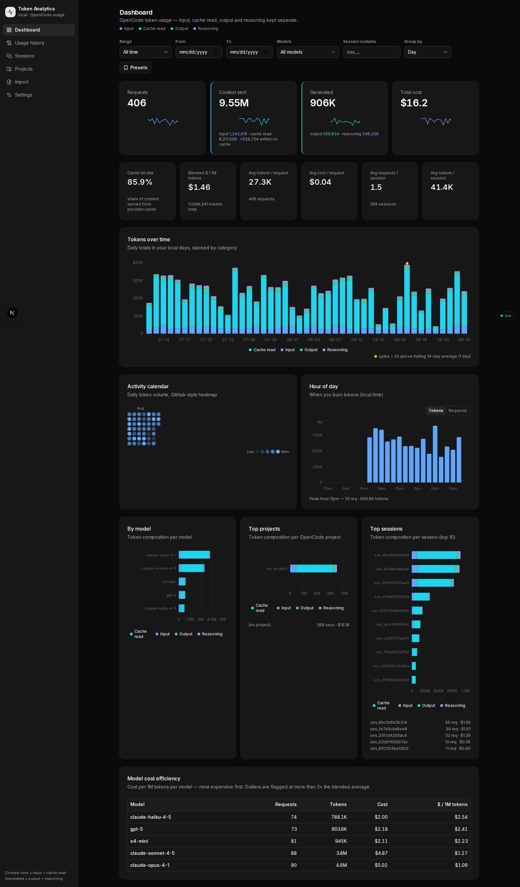
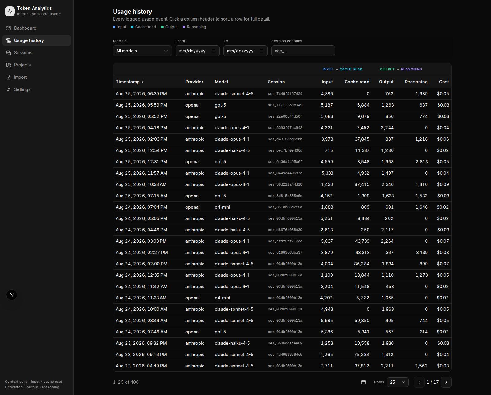
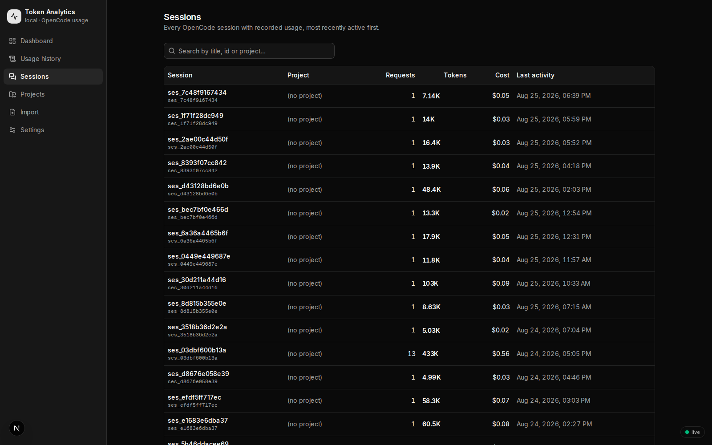
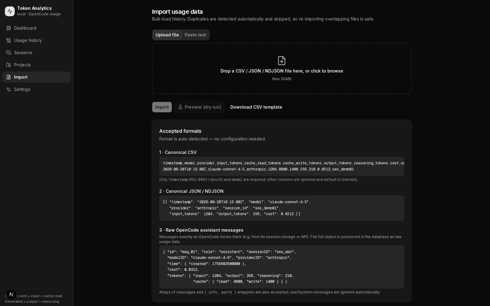

# opencode-usage

**Local-first analytics for your [OpenCode](https://opencode.ai) token usage & spend.**

[](LICENSE)

-green)


opencode-usage turns the usage data OpenCode *already records* into a fast, private, single-user dashboard: stacked token charts, a GitHub-style activity heatmap, cost-efficiency tables, cache-hit stats, and more.

> **No API keys. No cloud. No telemetry.** It never calls an LLM API and ships no tokenizer — every number you see comes from usage records your models already produced, stored in a local SQLite database on your machine.



## Why?

If you use OpenCode daily, you're generating detailed per-request usage records — input, cache read/write, output and reasoning tokens plus dollar cost — but they just sit in a local database. opencode-usage gives them a home where you can answer questions like:

- How many tokens did I burn this week, and on which model?
- What's my cache hit rate, and how much money did caching save me?
- Which hours of the day do I code hardest?
- Which projects/sessions were the most expensive?
- Am I paying way above my blended average on any model? *(outliers get flagged)*

## Screenshots

| Dashboard | Usage history |
|---|---|
|  |  |
| **Sessions** | **Import** |
|  |  |

## Features

- **Dashboard** — summary cards with previous-period deltas, group-by switchable chart (day/hour/model/session/project), calendar heatmap, hour-of-day histogram, top projects & sessions, model efficiency table with outlier flagging (>2× blended $/1M average).
- **Usage history** — sortable, paginated event table; click any row to inspect the raw request payload.
- **Sessions & Projects** — browse and rename (renames are stored locally as overrides), drill into per-session/project timelines.
- **Three ingestion paths** into one deduplicated store (see [How it works](#how-it-works)):
  1. One-click pull from OpenCode's own storage,
  2. a live JSONL log tailer, or
  3. manual paste/drag-drop import (CSV / JSON / NDJSON) with dry-run preview.
- **Live updates** — an SSE stream pushes changes within ~1s; no manual refreshing.
- **Timezone-aware** — day boundaries follow your browser's timezone via a cookie.
- **Saved filter presets** — persist date-range/model/provider filters in localStorage.
- **Export & reset** — CSV export and a guarded full-database reset from Settings.

## How it works

```
┌─────────────────────────────┐   pull    ┐
│ OpenCode storage            ├──────────▶│
│ ~/.local/share/opencode/    │           │   ┌──────────────────────────┐
│         opencode.db         │           ├──▶│ opencode-usage           │
└─────────────────────────────┘           │   │ SQLite DB (data/usage.db)│
┌─────────────────────────────┐   tail    │   │  usage_events / sessions │
│ OpenCode JSONL usage log    ├──────────▶│   │  / projects              │
└─────────────────────────────┘           │   └────────────┬─────────────┘
┌─────────────────────────────┐  paste /  │                │
│ CSV · JSON · NDJSON         ├──────────▶│        dashboard @ :3000
└─────────────────────────────┘  drop     ┘
```

All three paths funnel through a single normalizer (`src/lib/validation.ts`) that accepts either a **canonical flat record** or a **raw OpenCode assistant message**, auto-detected by shape. Records are deduplicated on `source_ref = "<sessionID>:<msgID>"` (with a SHA-256 content-hash fallback), so re-importing anything is safe — imports are idempotent.

## Quick start (demo mode)

Requirements: **Node.js 20+** and npm. No other services needed.

```bash
git clone https://github.com/ull0sm/opencode-usage.git
cd opencode-usage
npm install          # builds the better-sqlite3 native module (see Troubleshooting)

npm run seed         # optional: fill data/usage.db with ~30 days of fake demo data
npm run dev          # → http://localhost:3000
```

The SQLite database is created automatically on first request. Don't like the fake data? Settings → *Reset database* (or delete `data/usage.db*`).

## Using your real OpenCode data

OpenCode keeps its own SQLite database at `~/.local/share/opencode/opencode.db` (or `$XDG_DATA_HOME/opencode/opencode.db`). Three ways to feed it in:

### Option A — one-click pull (easiest)

Run the app, go to **Settings** (or **Import**) and hit **Pull from OpenCode storage**. Reads a snapshot of OpenCode's DB, so OpenCode can even be running while you do it.

### Option B — CLI import

```bash
npm run import-opencode                    # uses default location
npm run import-opencode -- --db /path/to/opencode.db   # custom location
```

Safe to re-run anytime — duplicates are skipped.

### Option C — live tail (near real-time)

If OpenCode writes usage to a JSONL log, tail it continuously:

```bash
npm run watch -- --file /path/to/usage.jsonl [--url http://localhost:3000] [--from-start]
```

Each complete line is POSTed to the API (~700ms polling); rotation, truncation and partial writes are handled. Leave it running alongside your workflow and the dashboard updates itself via SSE.

### Manual import formats

Drag a file onto **Import** or paste text directly. Format is auto-detected; `?dry_run=true` gives a preview without writing.

**CSV** (header row required):

```csv
timestamp,model,provider,session_id,input_tokens,cache_read_tokens,cache_write_tokens,output_tokens,reasoning_tokens,cost,source_ref
2026-08-24T10:15:00Z,claude-sonnet-4-5,anthropic,s_123,12000,48000,2000,950,310,0.1425,s_123:msg_1
```

Only `timestamp` and `model` are required; everything else defaults to 0/null. Timestamps accept ISO strings, epoch seconds or epoch milliseconds.

**JSON / NDJSON**: either canonical records (same fields as above, camelCase not required) or raw OpenCode assistant messages (`{ id, sessionID, modelID, time: { created }, tokens: { input, output, reasoning, cache: { read, write } }, cost }`) — mixed freely, line by line.

See `scripts/sample-import.json` for examples.

## Configuration

Everything runs on defaults; these environment variables are optional overrides.

| Variable | Used by | Default | Purpose |
|---|---|---|---|
| `TOKEN_ANALYSE_DB` | app + all scripts | `./data/usage.db` | Path to the app's SQLite database |
| `TOKEN_ANALYSE_DATA_DIR` | app | `./data` | Fallback data directory |
| `OPENCODE_DB` | importer script | `~/.local/share/opencode/opencode.db` | OpenCode source DB location |
| `XDG_DATA_HOME` | importer script | `~/.local/share` | XDG base used to locate `opencode/opencode.db` |
| `OPENCODE_USAGE_LOG` | watch script | — | JSONL log file to tail |
| `TOKEN_ANALYSE_URL` | watch script | `http://localhost:3000` | Base URL the watcher POSTs to |

Copy `.env.example` to `.env.local` to get started.

## Customization

A few things are deliberately hardcoded — easy to change in one place:

| What | Where | Notes |
|---|---|---|
| Token category colors | `src/lib/colors.ts` | Fixed palette shared by charts, cards & legend (blue/cyan/green/violet) |
| Currency (USD) | `src/lib/format.ts` | `Intl.NumberFormat` currency setting |
| Forced dark theme | `src/app/layout.tsx` | App renders dark-only; `next-themes` is installed if you want a light toggle |
| Live-refresh cadence | `src/app/api/events/route.ts` | SSE poll interval & heartbeat constants |
| Demo seed model pool | `scripts/seed.mjs` | Models used for generated fake data |

Costs are taken verbatim from the imported data — there is **no pricing table** in the app, so it stays correct as providers change prices.

## Scripts

| Command | What it does |
|---|---|
| `npm run dev` | Development server on `:3000` |
| `npm run build` / `npm start` | Production build & serve |
| `npm run lint` | ESLint |
| `npm run seed` | Generate ~30 days of fake demo data (`--days/--min/--max/--reset` flags available) |
| `npm run import-opencode` | Bulk import from OpenCode's storage (`--db <path>` flag available) |
| `npm run watch -- --file <jsonl>` | Tail a JSONL usage log into the app |

## Data & privacy

- Everything lives in `./data/usage.db` (+ WAL sidecars) — **on your machine only**.
- The app makes zero outbound requests; there are no analytics, keys or accounts.
- `data/` is gitignored, so your usage history can't leak into a commit.
- Deleting the files deletes your history; export a CSV from Settings first if you care about it.

## Project structure

```
src/
├── app/                  # Next.js App Router pages + API routes
│   ├── page.tsx          # Dashboard
│   ├── usage/            # Raw event history
│   ├── sessions/         # Session list & detail
│   ├── projects/         # Project list & detail
│   ├── import/           # Bulk import UI
│   ├── settings/         # DB info, export, reset
│   └── api/              # usage, import, export, stats/*, events (SSE)
├── components/           # charts/, dashboard/, ui/ (shadcn), per-feature
└── lib/
    ├── db/               # schema.sql + query layer (better-sqlite3)
    ├── validation.ts     # record normalizer + dedupe hashing
    └── filters.ts        # URL params → SQL, timezone day-shift
scripts/                  # seed.mjs, import-opencode.mjs, watch-opencode.mjs
```

## Troubleshooting

**`npm install` fails building `better-sqlite3`.**
It ships prebuilt binaries for common platforms; if yours isn't covered you'll need C/C++ build tools (on Debian/Ubuntu: `sudo apt install build-essential python3`). Corporate npm mirrors sometimes block the prebuilt download — see the [better-sqlite3 docs](https://github.com/WiseLibs/better-sqlite3/blob/master/docs/troubleshooting.md).

**Dashboard is empty after importing.**
Check the date-range preset in the filter bar (default view may not cover old data) and confirm rows landed: Usage page → count badge, or `Settings` → DB stats.

**Watcher says `file not found` / nothing arrives.**
Verify the path and that the app URL is reachable (`--url` / `TOKEN_ANALYSE_URL`), and that each JSONL line is a complete object.

## Contributing

Issues and PRs are welcome! See [CONTRIBUTING.md](CONTRIBUTING.md) for setup and guidelines.

## License

[MIT](LICENSE) © 2026 ull0sm
